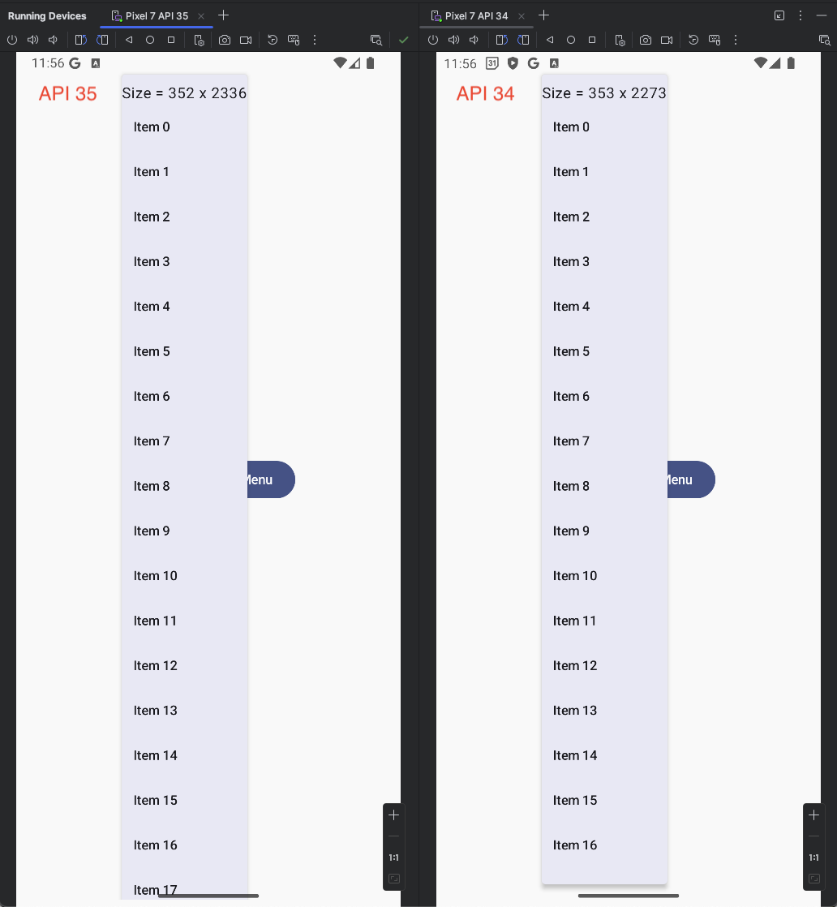

Dropdown Menu / Popup Issue on Android 15
-----------------------------------------

Popup menus that extend larger than the height of the available screen size are cut off starting from API 35 because of [changes](https://developer.android.com/about/versions/15/behavior-changes-15#stable-configuration) to the `Configuration` object on Android 15. 

> `Configuration.screenWidthDp` and `screenHeightDp` sizes no longer exclude the system bars.

The `PopupLayout` class generates a set of measurement specifications that are based on `Configuration.screenWidthDp` and `Configuration.screenHeightDp`. 

From the implementation of `PopupLayout` in `AndroidPopup.android.kt`:
```kotlin

// This returns a different value on API35, resulting in a popups that are cut off
private val displayHeight: Int
    get() {
        val density = context.resources.displayMetrics.density
        return (context.resources.configuration.screenHeightDp * density).fastRoundToInt()
    }

override fun internalOnMeasure(widthMeasureSpec: Int, heightMeasureSpec: Int) {
    if (properties.usePlatformDefaultWidth) {
        super.internalOnMeasure(widthMeasureSpec, heightMeasureSpec)
    } else {
        // usePlatformDefaultWidth false, so don't want to limit the popup width to the Android
        // platform default. Therefore, we create a new measure spec for width, which
        // corresponds to the full screen width. We do the same for height, even if
        // ViewRootImpl gives it to us from the first measure.
        val displayWidthMeasureSpec = makeMeasureSpec(displayWidth, MeasureSpec.AT_MOST)
        val displayHeightMeasureSpec = makeMeasureSpec(displayHeight, MeasureSpec.AT_MOST)
        super.internalOnMeasure(displayWidthMeasureSpec, displayHeightMeasureSpec)
    }
}
```

